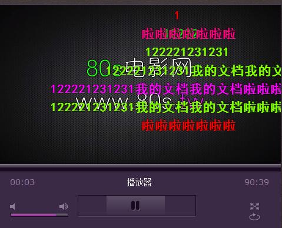

#jplayer弹幕插件

##目录文件
	- jplayer目录：/dist/jplayer/
	- plugin目录 ： /dist/jplayer-plugin
	- 演示demo : /danmuplayer.html
	
##依赖
	- 需要 jquery库
	- 需要 jplayer库
##引入方法
	需要引入的脚本
		/dist/jplayer-plugin/jplayer.plugin.danmu.js
		/dist/jplayer-plugin/style.css
	jplayer初始化后需要调用的函数
		$.fn.simpleDanmu.initDanmu({
			objectId:"jquery_jplayer_id",	//播放器id
			list:{{content:"",postTime:"00:00"}}, //弹幕数组
			postData:function(){
				//和服务器通信的函数
			}
		});

##使用方法:

	- 点击播放器弹出弹幕发射框

##预览

	
##其他 and 注释	   

/**
 * 简单的弹幕插件
 * jplayer-plugin
 * 
 * danmu:{
 * 		content:String,//必须
 * 		postTime:String,//必须 格式nn:nn
 * }
 * config:{
 * 		time:int,//弹幕运动时间 默认5000ms
		timeout:int,//弹幕多次点击间隔 默认3000ms
		objectId:String,//播放器的id,将通过此id选择播放器 //必须
		postData:CallBack,//一个提交数据到服务器的函数，不做封装 //非必须
		list:danmus,//danmu数组 必须
 * }
 * function initDanmu(config) 初始化弹幕环境
 * function biubiubiu(content) 将弹幕发射到屏幕
 * function send 将弹幕发射到屏幕且发送到服务器
 * 
 */